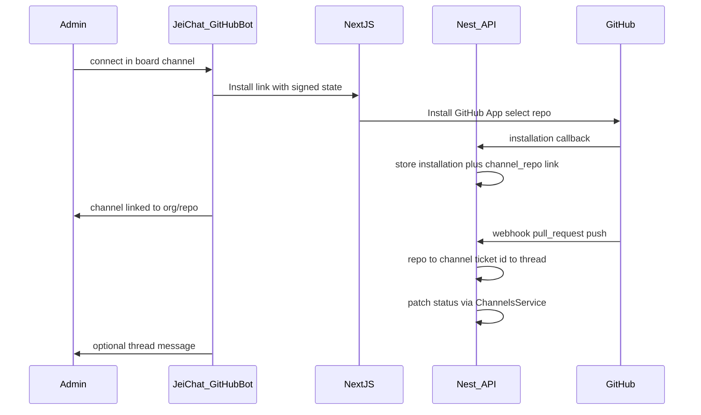

# GitHub Tickets Bot — Integration Plan

> GitHub App + first-party **@GitHub** bot: each ticket board channel links to exactly one repo; branch and pull request activity automatically updates ticket status. Linear-style automation with Discord-style connect UX.

---

## Table of Contents

1. [Goal and non-goals](#goal-and-non-goals)
2. [User experience](#user-experience)
3. [Mapping rules](#mapping-rules)
4. [Architecture](#architecture)
5. [Backend (implementation reference)](#backend-implementation-reference)
6. [GitHub App setup (operator checklist)](#github-app-setup-operator-checklist)
7. [Frontend (future)](#frontend-future)
8. [Phased rollout](#phased-rollout)
9. [Security and permissions](#security-and-permissions)
10. [Testing and rollout](#testing-and-rollout)
11. [Summary](#summary)

---

## Goal and non-goals

### Goal

- Link each **ticket board channel** (parent channel with a `ticketKey`) to **exactly one GitHub repository**.
- **Automatically update ticket status** when developers push branches and open, review, or merge pull requests that reference a ticket id.
- Provide a **first-party @GitHub bot** in chat with **Option A** connect flow: users authorize on GitHub’s site (install app / OAuth). No GitHub passwords or personal access tokens in chat messages.
- Post updates on **ticket threads** and in the existing **ticket events** timeline so boards and activity feeds stay in sync.

### Non-goals (v1)

- Listing on the **GitHub Marketplace** (optional later; not required to install on an org).
- **Two-way sync** with GitHub Issues (comments, labels, assignees on issues).
- Accepting **credentials in chat** (passwords, PATs).
- **Workspace-wide** “any repo can update any ticket” — repos are scoped **per board channel**.
- Full **comment mirroring** from GitHub into chat threads.
- In-app **code review / diffs** (Linear Diffs–class scope).

---

## User experience

### JeiChat operator (you, once)

1. Register **one GitHub App** under GitHub Developer settings.
2. Implement the Nest integration module, webhook handler, and first-party **@GitHub** persona (not a user-created workspace bot from `apps/api/src/bots/bots.service.ts`).
3. Deploy the API with a public HTTPS webhook URL (ngrok for local dev).

End users never visit GitHub Developer settings.

### Workspace administrator

1. Add or enable **@GitHub** in the workspace (integration entry point — settings and/or member list).
2. In a **ticket board channel** (parent channel, not an individual ticket thread), run **`connect`** or open **Channel settings → GitHub → Connect**.
3. Follow the link to GitHub → **Install JeiChat** on the organization → grant access to repos → select **the one repo** for this channel.
4. Return to JeiChat; **@GitHub** confirms: `#eng-tickets ↔ org/api` (example).

If the admin is not a GitHub org owner, GitHub may show **Request installation**; the bot should explain that an org owner must approve.

**Admin-only:** `connect`, `disconnect`. Members may use `status`, `help`, and read linked repo info where permitted.

### Developer (daily)

1. Use a branch or PR title that includes the ticket id, e.g. `ENG-42-fix-login` (matches board `ticketKey` + ticket number).
2. Push, open PR, merge as usual on GitHub.
3. Ticket status moves per automation rules (defaults below); PR link appears on the ticket; **@GitHub** may post a short message on the ticket thread.

Optional later: **Copy branch name** on the ticket UI (`ENG-42-slug-from-title`).

### Bot commands (v1)

| Command | Who | Where | Behavior |
|---------|-----|-------|----------|
| `connect` | Workspace admin | Ticket board channel | Start install flow; bind **this channel** to one repo |
| `disconnect` | Workspace admin | Ticket board channel | Remove channel ↔ repo link (automation stops for new events) |
| `status` | Member | Board channel | Show linked `owner/repo` and installation health |
| `repos` | Member | Board or workspace | List channel ↔ repo mappings (read-only overview) |
| `help` | Anyone | Anywhere | Short usage + branch naming hint |

Commands may be implemented as `@github …`, slash commands, or buttons that deep-link the same flows.

---

## Mapping rules

### One repo per one channel

| Entity | Rule |
|--------|------|
| **Parent channel** | Ticket board only (`parentId` is null, has `ticketKey`). Exactly **one** linked GitHub repo. |
| **Ticket threads** | Child channels under that board. Inherit the **parent’s repo**; no separate repo link per ticket. |
| **Webhook `owner/repo`** | Lookup yields **at most one** board channel in a workspace. |
| **Ticket id parsing** | Only match tickets under that board: `ticketKey` + `ticketNumber` from `apps/api/src/database/schema/channels.ts`. |

### Product uniqueness rules (recommended)

- **One repo row per channel** — reconnecting replaces the previous repo for that channel.
- **One channel per repo per workspace** — avoid two boards both consuming the same repo’s webhooks (ambiguous ticket routing). Document as enforced in API validation.

### Linking PRs / branches to tickets

- **Primary (v1):** Case-insensitive match of `{ticketKey}-{ticketNumber}` in PR title, head branch name, or (phase 4) PR description with magic words (`Fixes ENG-42`).
- Ignore events for repos with **no** linked board channel.
- Ignore ticket ids that do not exist under the linked board.

Ticket display ids align with `ticketDisplayId()` in `apps/web/app/(chat)/_helpers/ticket-fields.ts`.

---

## Architecture

### Components

```text
┌─────────────────────────────────────────────────────────┐
│  apps/web — Next.js                                      │
│  Channel settings (Connect GitHub) + optional chat UI    │
└────────────────────┬────────────────────────────────────┘
                     │ Better Auth session (admin actions)
┌────────────────────▼────────────────────────────────────┐
│  apps/api — integrations/github                          │
│  Install URL + callback (signed state)                   │
│  POST /integrations/github/webhook (HMAC verified)       │
│  Command handler → posts as @GitHub                      │
└────────────┬───────────────────────────┬────────────────┘
             │                           │
     GitHub App installation token      Webhooks:
     (server-side only)                  pull_request, push,
                                         installation, …
             │                           │
             └───────────┬───────────────┘
                         ▼
              ChannelsService — patch ticket status
              ticket_events — timeline entries
              Messages / gateway — @GitHub thread posts
```

### Connect and automation sequence



### GitHub App vs @GitHub bot

| Layer | Role |
|-------|------|
| **GitHub App** | Installed on customer org; sends webhooks; grants API access per installation. |
| **@GitHub bot** | Chat UX: connect, help, confirmations, optional PR/status announcements. |
| **User-created bots** (`POST /workspaces/:id/bots`) | Unrelated; customers must not create their own GitHub integration bot. |

---

## Backend (implementation reference)

### Proposed module layout

| Piece | Location | Notes |
|-------|----------|--------|
| Module | `apps/api/src/integrations/github/` | `github.module.ts`, `github.controller.ts`, `github.service.ts` |
| Webhook | `POST /integrations/github/webhook` | `@AllowAnonymous()`; verify `X-Hub-Signature-256` |
| Install | `GET /integrations/github/install` | Query: `workspaceId`, `channelId`; redirect to GitHub |
| Callback | `GET /integrations/github/callback` | Verify signed `state`; persist installation + channel repo |
| Ticket updates | `apps/api/src/channels/channels.service.ts` | Reuse status patch paths; emit `ticket-events` |
| Bot messages | System @GitHub user or internal post API | Do not use Bot token for GitHub API calls |

Register `GithubModule` in `apps/api/src/app.module.ts` when implementing.

### Proposed schema (Drizzle)

**`github_installations`**

- `id`, `workspaceId`, `installationId` (GitHub numeric id), `accountLogin`, `installedByUserId`, `createdAt`, `updatedAt`

**`channel_github_repos`**

- `id`, `workspaceId`, `channelId` (parent board only), `installationId`, `owner`, `repo`, `connectedByUserId`, `createdAt`
- Unique: `channelId`; unique: `(workspaceId, owner, repo)` if enforcing one channel per repo

**`github_pr_links`** (optional, phase 2+)

- `channelId` (ticket thread id), `owner`, `repo`, `prNumber`, `headRef`, `htmlUrl`, `state`, `updatedAt`

After schema changes: `bun run db:generate` and `bun run db:migrate` from `apps/api/`.

### Signed `state` (install callback)

Payload (HMAC-signed, short TTL):

- `workspaceId`, `channelId`, `userId`, `nonce`, `exp`

Prevents cross-workspace hijack and binds install completion to the board channel that started connect.

### Default status automation

Ticket statuses (existing): `backlog`, `todo`, `in_progress`, `in_review`, `done`, `cancelled` — see `TICKET_STATUSES` in `apps/web/app/(chat)/_helpers/ticket-fields.ts`.

| GitHub event | Default ticket status | Notes |
|--------------|----------------------|--------|
| Push to branch matching ticket id | `in_progress` | Optional in phase 2; can defer to PR-only |
| PR opened (non-draft) | `in_review` | |
| PR merged | `done` | Set `completedAt` consistent with existing done-ticket behavior |
| PR closed, not merged | No change or `in_progress` | Product choice; document in channel settings later |

Configurable per board/workspace in phase 4 (Linear-style workflow settings).

### Loop prevention

When updating from webhooks:

- Record `lastGithubDeliveryId` or compare GitHub `updated_at` on PR/issue.
- Optional `syncSource: 'github' | 'jeichat'` on writes; skip echo webhooks triggered by your own API updates for a short window.

### Installation token usage

Use GitHub App installation access tokens (JWT + installation token exchange) server-side only. Never expose to the browser or chat.

---

## GitHub App setup (operator checklist)

1. **GitHub → Settings → Developer settings → GitHub Apps → New GitHub App**
2. **Name:** e.g. `JeiChat` (slug used in install URLs).
3. **Homepage URL:** product URL.
4. **Callback URL** (OAuth user authorization, optional for v1): `https://<api-host>/integrations/github/callback`
5. **Setup URL** (required for channel link): same path — `https://<api-host>/integrations/github/callback`. Enable **Redirect on update**.
6. **Webhook URL:** `https://<api-host>/integrations/github/webhook` (not `/integrations/github` alone).
7. **Webhook secret:** generate and store as `GITHUB_WEBHOOK_SECRET`.
8. **Permissions (read, minimal v1):**
   - Metadata: Read
   - Pull requests: Read
   - Contents: Read (if parsing push events on branches)
9. **Subscribe to events:**
   - `pull_request`
   - `push` (if using branch-push → in progress)
   - `installation`
   - `installation_repositories`
10. **Generate a private key**; store as `GITHUB_APP_PRIVATE_KEY` (PEM, multiline env).
11. Note **App ID** → `GITHUB_APP_ID`.

**Marketplace:** not required. Install via **Install App** on the app settings page or your product’s connect link.

### Environment variables (when implementing)

Add to monorepo `.env.example`:

```env
GITHUB_APP_ID=
GITHUB_APP_PRIVATE_KEY=
GITHUB_WEBHOOK_SECRET=
GITHUB_APP_SLUG=jeichat
```

---

## Frontend (future)

### Channel settings (ticket board)

- Section **GitHub**: linked `owner/repo`, **Connect** / **Disconnect**, link to GitHub repo.
- Same install URL as bot `connect`; `channelId` in query/state.

### Ticket thread UI

- **Linked pull requests** list (title, state, link out).
- **Copy branch name** action: `{ticketKey}-{ticketNumber}-{slug}`.

### Board view

- Column **Pull requests** exists in `apps/web/app/(chat)/w/[workspaceId]/(chat-shell)/c/[channelId]/_components/board-display-menu.tsx` — wire to PR link data in a later phase.

### Workspace overview (optional)

- Read-only table: channel name ↔ repo for all links in the workspace.

Data fetching: TanStack Query + Axios per project conventions; admin connect uses full-page redirect to GitHub and callback to web or API.

---

## Phased rollout

| Phase | Scope | Exit criteria |
|-------|--------|----------------|
| **1** | GitHub App registration; install + callback; persist `github_installations` + `channel_github_repos`; @GitHub / settings confirmation message | Admin can link one board channel to one repo |
| **2** | Webhook handler; parse ticket id; PR opened/merged → status + `ticket_events`; optional `github_pr_links` | Merging a PR with `ENG-42` in branch/title moves ticket to `done` |
| **3** | Chat commands (`help`, `status`, `disconnect`); copy branch name; PR chip on ticket UI | Devs need no settings after channel link |
| **4** | Magic words in PR body; merge-target branch rules (`main` vs `staging`); CI/check badge on ticket | Parity with common Linear workflows |

---

## Security and permissions

- **Connect / disconnect:** workspace **administrators** only — align with `WorkspacePermissionsService` / `is_administrator` on roles (`apps/api/src/workspaces/`).
- **Webhook endpoint:** signature verification mandatory; reject unsigned or invalid payloads.
- **Install callback:** signed `state`, short expiry, bind to initiating user and channel.
- **Secrets:** installation tokens and private key only on server; encrypted at rest if the platform supports it.
- **Chat:** never prompt for GitHub password or PAT; use install/OAuth links only.
- **Repo access:** respect GitHub installation repository selection; if user adds a repo on channel that is not in the installation, bot instructs to update installation on GitHub.

---

## Testing and rollout

### Unit tests

- Ticket id regex: `ENG-42`, case variants, false positives in branch names.
- Repo → channel lookup; reject unknown repos and duplicate mappings.
- Status rule engine: PR payload fixtures → expected `TicketStatus`.

### E2E / integration

- Mock GitHub webhook POSTs with valid HMAC (fixture secret).
- Session flow pattern similar to `apps/api/test/bots.session-e2e-spec.ts` for admin-only connect routes.

### Manual QA checklist

1. Install app on test org; link board channel to test repo.
2. Create ticket `KEY-1`; branch `key-1-feature`; open PR → ticket `in_review`.
3. Merge PR → ticket `done` and timeline entry.
4. PR on unlinked repo → no ticket changes.
5. Non-admin cannot `connect`.

### Rollout

- Feature-flag workspace or env `GITHUB_INTEGRATION_ENABLED`.
- Document ngrok + install steps for local dev in API README or this doc’s checklist.

---

## Summary

> **One GitHub App** and **one @GitHub bot** per product; each **ticket board channel** links to **one repo**; **webhooks** match branch/PR references to ticket ids and drive **status** (`in_progress` / `in_review` / `done`); **Linear-style automation** with **Discord-style connect** (authorize on GitHub, no credentials in chat).

---

## Related code (today)

| Area | Path |
|------|------|
| Ticket channel fields | `apps/api/src/database/schema/channels.ts` |
| Ticket status patch | `apps/api/src/channels/channels.service.ts` |
| Ticket event types | `apps/api/src/channels/ticket-events.ts` |
| Ticket status UI constants | `apps/web/app/(chat)/_helpers/ticket-fields.ts` |
| Workspace bots (custom, not GitHub) | `apps/api/src/bots/bots.service.ts` |
